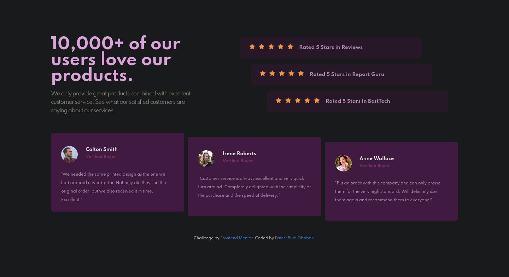

# Frontend Mentor - Social-Proof-Section solution

This is a solution to the [social proof section challenge on Frontend Mentor](https://www.frontendmentor.io/challenges/social-proof-section). Frontend Mentor challenges help you improve your coding skills by building realistic projects.

## Table of contents

- [Overview](#overview)
  - [The challenge](#the-challenge)
  - [Screenshot](#screenshot)
  - [Link](#link)
- [My process](#my-process)
  - [Built with](#built-with)
- [Author](#author)

## Overview

### The challenge

Users should be able to:

- View the optimal layout depending on their device's screen size

### Screenshot

### Links

- Live Site URL: [social-proof-section](https://social-section-fem.netlify.app/)

## My process

### Built with

- Semantic HTML5 markup
- CSS custom properties
- Flexbox
- Grid
- Mobile-first workflow

## Author

- Frontend Mentor - [@gbabohernest](https://www.frontendmentor.io/profile/gbabohernest)
- Twitter - [@gbaboh_dev](https://twitter.com/gbaboh_dev)
