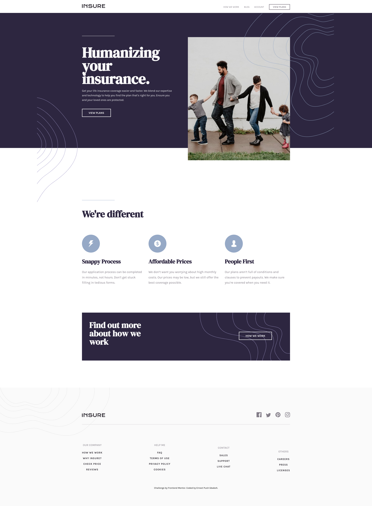

# Frontend Mentor - Insure landing page

This is a solution to the [Insure landing page coding challenge on Frontend Mentor]("#"). Frontend Mentor challenges help you improve your coding skills by building realistic projects.

## Table of contents

- [Overview](#overview)
  - [The challenge](#the-challenge)
  - [Screenshot](#screenshot)
  - [Link](#links)
- [My process](#my-process)

  - [Built with](#built-with)

- [Author](#author)

## Overview

### The challenge

Users should be able to:

- View the optimal layout for the site depending on their device's screen size

### Screenshot

### Link

- Live Site URL: [insure-landing-page](https://fem-insure-lp.netlify.app/)

## My process

### Built with

- Semantic HTML5 markup
- Scss
- CSS custom properties
- Flexbox
- CSS Grid
- Mobile-first workflow
- Vanilla Javascript for toggle nav button

## Author

- Frontend Mentor - [@gbabohernest](https://www.frontendmentor.io/profile/gbabohernest)
- Twitter - [@gbaboh_dev](https://twitter.com/gbaboh_dev)
